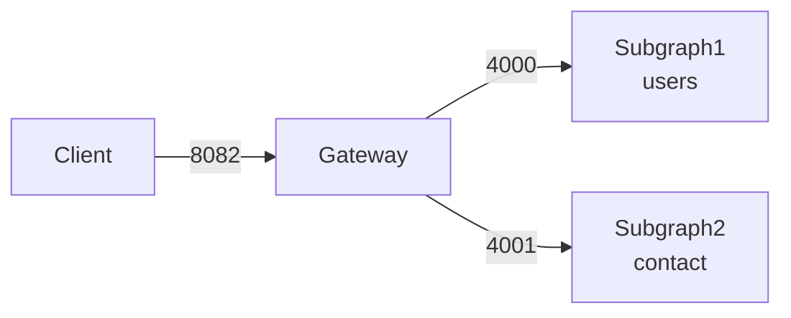

# go-graphql-federation-example
Implement GraphQL Federation.



## Installation
```bash
go install github.com/99designs/gqlgen@latest
go get github.com/99designs/gqlgen/graphql/handler
```

## Add Subgraph
### Add `Service`
- `schema.graphqls`
```graphql
type Service {
  name: String!
  version: String!
  schema: String!
}
```

### Generate
```bash
gqlgen generate
```

### Add resolver

## Running Subgraph1
```bash
vscode ➜ /workspaces/go-graphql-federation-example/users (main) $ go run server.go 
2023/07/25 04:31:12 connect to http://localhost:4000/ for GraphQL playground
```

```bash
vscode ➜ /workspaces/go-graphql-federation-example (main) $ curl -X POST -H "Content-Type: Application/json" -d '{"query":"{ todos { id } }"}' http://localhost:4000/query
{"data":{"todos":[{"id":"TODO-1"},{"id":"TODO-2"}]}}
vscode ➜ /workspaces/go-graphql-federation-example (main) $ 
```

## Running Gateway
```bash
go install github.com/movio/bramble/cmd/bramble@latest
touch config.json
```

```bash
cd cmd/bramble/
go run main.go -conf ./config.json 
```

## Querying Gateway
### users | `id` only
```bash
vscode ➜ /workspaces/go-graphql-federation-example (main) $ curl -X POST -H "Content-Type: Application/json" -d '{"query":"{ todos { id } }"}' http://localhost:8082/query
{"data":{"todos":[{"id":"TODO-1"},{"id":"TODO-2"}]}}
vscode ➜ /workspaces/go-graphql-federation-example (main) $ 
```

### users | `id` and `text`
```bash
vscode ➜ /workspaces/go-graphql-federation-example (main) $ curl -X POST -H "Content-Type: Application/json" -d '{"query":"{ todos { id text } }"}' http://localhost:8082/query
{"data":{"todos":[{"id":"TODO-1","text":"My Todo 1"},{"id":"TODO-2","text":"My Todo 2"}]}}vscode ➜ /workspaces/go-graphql-federation-example (main) $
```

### contact 
```bash
root ➜ /workspaces/go-graphql-federation-example/contact (main) $ curl -X POST -H "Content-Type: Application/json" -d '{"query":"{ contacts { firstname } }"}' http://localhost:8082/query
{"data":{"contacts":[{"firstname":"mirai"}]}}
root ➜ /workspaces/go-graphql-federation-example/contact (main) $ 
```

## Implement your own schema
### Create directory
```bash
mkdir -p contact
go mod init github.com/danny-yamamoto/go-graphql-federation-example/contact
go get -u github.com/99designs/gqlgen
go install github.com/99designs/gqlgen@latest
go get github.com/99designs/gqlgen/graphql/handler
```
### Add a package directory to go.work
### Create a schema file
```bash
touch schema.graphqls
touch gqlgen.yml
gqlgen generate
```

## Reference
- [GraphQL の基本](https://learn.microsoft.com/ja-jp/azure/developer/javascript/how-to/with-web-app/graphql/static-web-app-graphql/graphql-basics)
- [Bramble Getting started](https://movio.github.io/bramble/#/getting-started?id=querying-bramble)
- [Apollo Federation](https://gqlgen.com/recipes/federation/)
